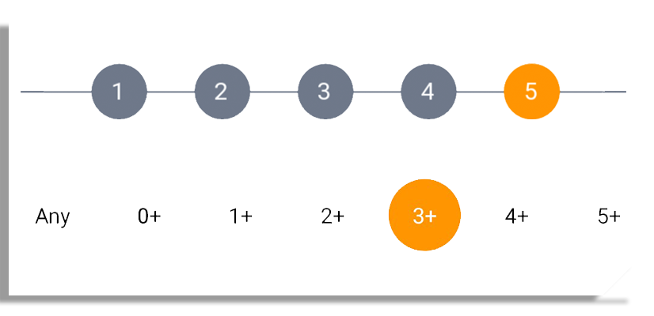

# Android Wizard
 
Take it as a plugin for wizards to track the change in pages  
The dependency is available on **jcenter()** and **mavenCentral()**



# Integration


Add the following to your **build.gradle(App)**
```gradle  

    dependencies {
        //other dependencies
        compile 'com.jswiftdev.wizard:wizardindicator:0.1.1'
    }
```

## Wizard Indicator
To use the Wizard Indicator
In your layout add the following view
```xml
   <com.jswiftdev.wizard.LineIndicator
           android:id="@+id/indicator"
           android:layout_width="match_parent"
           android:layout_height="100dp"
           app:activeCircleColor="@color/apple_orange"
           app:activePage="3"
           app:circleColor="@color/deep_silver"
           app:circleRadius="50"
           app:lineColor="@color/deep_silver"
           app:lineWidth="3"
           app:numberOfPages="5"
           app:textSize="30" />
```
to manipulate the changes from page to page, you can use

```java
    import com.jswiftdev.wizard.Indicator;
    
    @Override
    protected void onCreate(Bundle savedInstanceState) {
        WizardIndicator indicator = (WizardIndicator)findViewById(R.id.indicator);
    
        //to change from one active page to another
        indicator.setActivePage(1);
        
        //set the number of pages
        indicator.setNumberOfPages(5);
    }
```

while using it with viewpager add **indicator.setActivePage(position);** in **onTabSelected(...)** method  
as shown below

## Slide Selector
To use the slide selector add the following in your layout file
```xml
    <com.jswiftdev.wizard.SlideSelector
            android:clickable="false"
            android:id="@+id/slider_selector"
            android:layout_width="match_parent"
            android:layout_height="wrap_content"
            android:layout_below="@+id/indicator"
            app:activeTextColor="@color/white"
            app:choicesArrayId="@array/options"
            app:drawableId="@drawable/another_back"
            app:inActiveTextColor="@color/black"
            app:tColor="@color/black"
            app:textPadding="20" />
```

from your Activity or fragment use
```java
...
    SlideSelector slideSelector = findViewById(R.id.slider_selector);
    slideSelector.setSelectionChanges(new SlideSelector.SelectionChanges() {
        @Override
        public void onSelectedIndexChanged(String selectedItem) {
            //get the selected item from the provided array @array/options
        }
    });

//choose different selection as default
slideSelector.setSelectedIndex(4);
...
```

# License

Copyright 2017 Jswiftdev.

Licensed under the Apache License, Version 2.0 (the "License");
you may not use this file except in compliance with the License.
You may obtain a copy of the License at

http://www.apache.org/licenses/LICENSE-2.0

Unless required by applicable law or agreed to in writing, software
distributed under the License is distributed on an "AS IS" BASIS,
WITHOUT WARRANTIES OR CONDITIONS OF ANY KIND, either express or implied.
See the License for the specific language governing permissions and
limitations under the License.